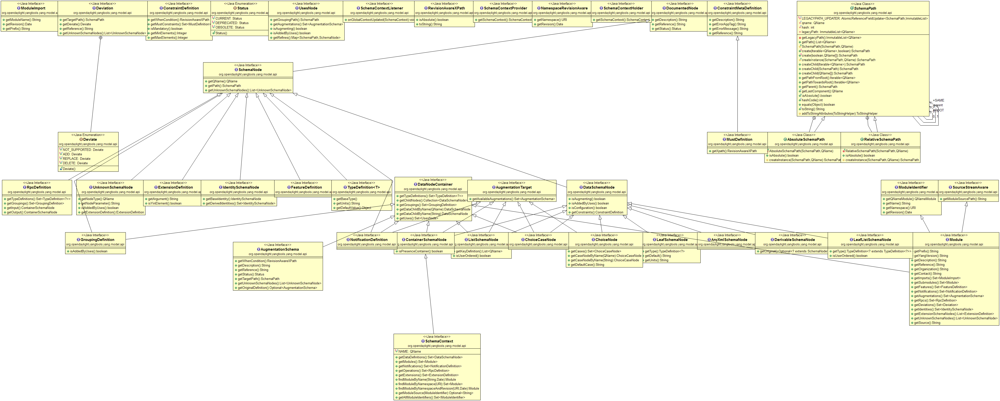
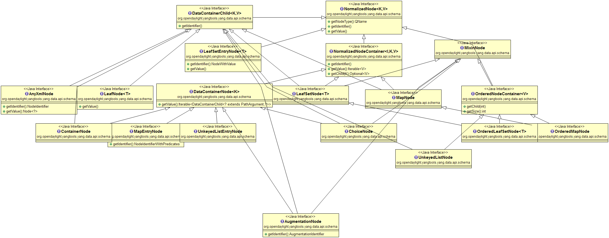

= Developer Guide
:rfc6020: https://tools.ietf.org/html/rfc6020
:lhotka-yang-json: https://tools.ietf.org/html/draft-lhotka-netmod-yang-json-01

== Overview
YANG Tools is set of libraries and tooling providing support for use {rfc6020}[YANG] for Java (or other JVM-based language) projects and applications.

YANG Tools provides following features in OpenDaylight:

- parsing of YANG sources and
semantic inference of relationship across YANG models as defined in
{rfc6020}[RFC6020]
- representation of YANG-modeled data in Java
** *Normalized Node* representation - DOM-like tree model, which uses conceptual
  meta-model more tailored to YANG and OpenDaylight use-cases than a standard XML
  DOM model allows for.
- serialization / deserialization of YANG-modeled data driven by YANG
models
** XML - as defined in {rfc6020}[RFC6020]
** JSON - as defined in {rfc6020}[draft-lhotka-netmod-yang-json-01]
** support for third-party generators processing YANG models.

=== Architecture
YANG Tools project consists of following logical subsystems:

- *Commons* - Set of general purpose code, which is not specific to YANG, but
  is also useful outside YANG Tools implementation.
- *YANG Model and Parser* - YANG semantic model and lexical and semantic parser
  of YANG models, which creates in-memory cross-referenced represenation of
  YANG models, which is used by other components to determine their behaviour
  based on the model.
- *YANG Data* - Definition of Normalized Node APIs and Data Tree APIs, reference
  implementation of these APIs and implementation of XML and JSON codecs for
  Normalized Nodes.
- *YANG Maven Plugin* - Maven plugin which integrates YANG parser into Maven
  build lifecycle and provides code-generation framework for components, which
  wants to generate code or other artefacts based on YANG model.

=== Concepts
Project defines base concepts and helper classes which are project-agnostic and could be used outside of YANG Tools project scope. 

=== Components

- yang-common
- yang-data-api
- yang-data-codec-gson
- yang-data-impl
- yang-data-jaxen
- yang-data-transform
- yang-data-util
- yang-maven-plugin
- yang-maven-plugin-it
- yang-maven-plugin-spi
- yang-model-api
- yang-model-export
- yang-model-util
- yang-parser-api
- yang-parser-impl

==== YANG Model API
Class diagram of yang model API

==== YANG Parser

Yang Statement Parser works on the idea of statement concepts as defined in RFC6020, section 6.3. We come up here with basic ModelStatement and StatementDefinition, following RFC6020 idea of having sequence of statements, where
every statement contains keyword and zero or one argument. ModelStatement is extended by DeclaredStatement (as it comes from source, e.g. YANG source)
and EffectiveStatement, which contains other substatements and tends to represent result of semantic processing of other statements (uses, augment for YANG). 
IdentifierNamespace represents common superclass for YANG model namespaces.

Input of the Yang Statement Parser is a collection of StatementStreamSource objects.
StatementStreamSource interface is used for inference of effective model
and is required to emit its statements using supplied StatementWriter.
Each source (e.g. YANG source) has to be processed in three steps
in order to emit different statements for each step.
This package provides support for various namespaces used across statement parser
in order to map relations during declaration phase process.

Currently, there are two implementations of StatementStreamSource in Yangtools:

 - YangStatementSourceImpl - intended for yang sources
 - YinStatementSourceImpl - intended for yin sources

==== YANG Data API
Class diagram of yang data API

==== YANG Data Codecs

==== YANG Maven Plugin
Maven plugin which integrates YANG parser into Maven
  build lifecycle and provides code-generation framework for components, which
  wants to generate code or other artefacts based on YANG model.

== How to / Tutorials

=== Working with YANG Model
First thing you need to do if you want to work with YANG models is to instantiate a SchemaContext object. This object type describes one or more parsed YANG modules. 

In order to create it you need to utilize YANG statement parser which takes one or more StatementStreamSource objects as input and then produces the SchemaContext object. 

StatementStreamSource object contains the source file information. It has two implementations, one for YANG sources - YangStatementSourceImpl, and one for YIN sources - YinStatementSourceImpl. 

Here is an example of creating StatementStreamSource objects for YANG files, providing them to the YANG statement parser and building the SchemaContext:

[source,java]
----
StatementStreamSource yangModuleSource = new YangStatementSourceImpl("/example.yang", false);
StatementStreamSource yangModuleSource2 = new YangStatementSourceImpl("/example2.yang", false);

CrossSourceStatementReactor.BuildAction reactor = YangInferencePipeline.RFC6020_REACTOR.newBuild();
reactor.addSources(yangModuleSource, yangModuleSource2);

SchemaContext schemaContext = reactor.buildEffective();
----

First, StatementStreamSource objects with two constructor arguments should be instantiated: path to the yang source file (which is a regular String object) and a boolean which determines if the path is absolute or relative. 

Next comes the initiation of new yang parsing cycle - which is represented by  CrossSourceStatementReactor.BuildAction object. You can get it by calling method newBuild() on CrossSourceStatementReactor object (RFC6020_REACTOR) in YangInferencePipeline class. 

Then you should feed yang sources to it by calling method addSources() that takes one or more StatementStreamSource objects as arguments.

Finally you call the method buildEffective() on the reactor object which returns EffectiveSchemaContext (that is a concrete implementation of SchemaContext). Now you are ready to work with contents of the added yang sources.

Let us explain how to work with models contained in the newly created SchemaContext. If you want to get all the modules in the schemaContext, you have to call method getModules() which returns a Set of modules. If you want to get all the data definitions in schemaContext, you need to call method getDataDefinitions, etc.

[source, java]
Set<Module> modules = schemaContext.getModules();
Set<DataSchemaNodes> dataSchemaNodes = schemaContext.getDataDefinitions();

Usually you want to access specific modules. Getting a concrete module from SchemaContext is a matter of calling one of these methods: 

* findModuleByName(),
* findModuleByNamespace(),
* findModuleByNamespaceAndRevision().

In the first case, you need to provide module name as it is defined in the yang source file and module revision date if it specified in the yang source file (if it is not defined, you can just pass a null value). In order to provide the revision date in proper format, you can use a utility class named SimpleDateFormatUtil.

[source, java]
Module exampleModule = schemaContext.findModuleByName("example-module", null);
// or
Date revisionDate = SimpleDateFormatUtil.getRevisionFormat().parse("2015-09-02");
Module exampleModule = schemaContext.findModuleByName("example-module", revisionDate);

In the second case, you have to provide module namespace in form of an URI object.
[source, java]
Module exampleModule = schema.findModuleByNamespace(new URI("opendaylight.org/example-module"));

In the third case, you provide both module namespace and revision date as arguments.

Once you have a Module object, you can access its contents as they are defined in YANG Model API.
One way to do this is to use method like getIdentities() or getRpcs() which will give you a Set of objects. Otherwise you can access a DataSchemaNode directly via the method getDataChildByName() which takes a QName object as its only argument. Here are a few examples.

[source, java]
----
Set<AugmentationSchema> augmentationSchemas = exampleModule.getAugmentations();
Set<ModuleImport> moduleImports = exampleModule.getImports();

ChoiceSchemaNode choiceSchemaNode = (ChoiceSchemaNode) exampleModule.getDataChildByName(QName.create(exampleModule.getQNameModule(), "example-choice"));

ContainerSchemaNode containerSchemaNode = (ContainerSchemaNode) exampleModule.getDataChildByName(QName.create(exampleModule.getQNameModule(), "example-container"));
----

=== Working with YANG Data
If you want to work with YANG Data you are going to need NormalizedNode objects that are specified in the YANG Data API. NormalizedNode is an interface at the top of the YANG Data hierarchy. It is extended through sub-interfaces which define the behaviour of specific NormalizedNode types like AnyXmlNode, ChoiceNode, LeafNode, ContainerNode, etc. Concrete implemenations of these interfaces are defined in yang-data-impl module. Once you have one or more NormalizedNode instances, you can perform CRUD operations on YANG data tree which is an in-memory database designed to store normalized nodes in a tree-like structure.

In some cases it is clear which NormalizedNode type belongs to which yang statement (e.g. AnyXmlNode, ChoiceNode, LeafNode). However, there are some normalized nodes which are named differently from their yang counterparts. They are listed below:

* LeafSetNode - leaf-list
* OrderedLeafSetNode - leaf-list that is ordered-by user
* LeafSetEntryNode - concrete entry in a leaf-list
* MapNode - keyed list
* OrderedMapNode - keyed list that is ordered-by user
* MapEntryNode - concrete entry in a keyed list
* UnkeyedListNode - unkeyed list
* UnkeyedListEntryNode - concrete entry in an unkeyed list

In order to create a concrete NormalizedNode object you can use the utility class Builders or ImmutableNodes. These classes can be found in yang-data-impl module and they provide methods for building each type of normalized node. Here is a simple example of building a normalized node:

[source, java]
----
\\ example 1
ContainerNode containerNode = Builders.containerBuilder().withNodeIdentifier(new YangInstanceIdentifier.NodeIdentifier(QName.create(moduleQName, "example-container")).build();

\\ example 2
ContainerNode containerNode2 = Builders.containerBuilder(containerSchemaNode).build();
----
Both examples produce the same result. NodeIdentifier is one of the four types of YangInstanceIdentifier (these types are described in the javadoc of YangInstanceIdentifier). The purpose of YangInstanceIdentifier is to uniquely identify a particular node in the data tree. In the first example, you have to add NodeIdentifier before building the resulting node. In the second example it is also added using the provided ContainerSchemaNode object. 

ImmutableNodes class offers similar builder methods and also adds an overloaded method called fromInstanceId() which allows you to create a NormalizedNode object based on YangInstanceIdentifier and SchemaContext. Below is an example which shows the use of this method.

[source, java]
----
YangInstanceIdentifier.NodeIdentifier contId = new YangInstanceIdentifier.NodeIdentifier(QName.create(moduleQName, "example-container");

NormalizedNode<?, ?> contNode = ImmutableNodes.fromInstanceId(schemaContext, YangInstanceIdentifier.create(contId));
----

Let us show a more complex example of creating a NormalizedNode. First, consider the following YANG module:

[source, yang]
----
module example-module {
    namespace "opendaylight.org/example-module";
    prefix "example";

    container parent-container {
        container child-container {
            list parent-ordered-list {
                ordered-by user;

                key "parent-key-leaf";

                leaf parent-key-leaf {
                    type string;
                }

                leaf parent-ordinary-leaf {
                    type string;
                }

                list child-ordered-list {
                    ordered-by user;

                    key "child-key-leaf";

                    leaf child-key-leaf {
                        type string;
                    }

                    leaf child-ordinary-leaf {
                        type string;
                    }
                }
            }
        }
    }
}
----

In the following example, two normalized nodes based on the module above are written to and read from the data tree.

[source, java]
----
TipProducingDataTree inMemoryDataTree =     InMemoryDataTreeFactory.getInstance().create(TreeType.OPERATIONAL);
inMemoryDataTree.setSchemaContext(schemaContext);

// first data tree modification
MapEntryNode parentOrderedListEntryNode = Builders.mapEntryBuilder().withNodeIdentifier(
new YangInstanceIdentifier.NodeIdentifierWithPredicates(
parentOrderedListQName, parentKeyLeafQName, "pkval1"))
.withChild(Builders.leafBuilder().withNodeIdentifier(
new YangInstanceIdentifier.NodeIdentifier(parentOrdinaryLeafQName))
.withValue("plfval1").build()).build();

OrderedMapNode parentOrderedListNode = Builders.orderedMapBuilder().withNodeIdentifier(
new YangInstanceIdentifier.NodeIdentifier(parentOrderedListQName))
.withChild(parentOrderedListEntryNode).build();

ContainerNode parentContainerNode = Builders.containerBuilder().withNodeIdentifier(
new YangInstanceIdentifier.NodeIdentifier(parentContainerQName))
.withChild(Builders.containerBuilder().withNodeIdentifier(
new NodeIdentifier(childContainerQName)).withChild(parentOrderedListNode).build()).build();

YangInstanceIdentifier path1 = YangInstanceIdentifier.of(parentContainerQName);

DataTreeModification treeModification = inMemoryDataTree.takeSnapshot().newModification();
treeModification.write(path1, parentContainerNode);

// second data tree modification
MapEntryNode childOrderedListEntryNode = Builders.mapEntryBuilder().withNodeIdentifier(
new YangInstanceIdentifier.NodeIdentifierWithPredicates(
childOrderedListQName, childKeyLeafQName, "chkval1"))
.withChild(Builders.leafBuilder().withNodeIdentifier(
new YangInstanceIdentifier.NodeIdentifier(childOrdinaryLeafQName))
.withValue("chlfval1").build()).build();

OrderedMapNode childOrderedListNode = Builders.orderedMapBuilder().withNodeIdentifier(
new YangInstanceIdentifier.NodeIdentifier(childOrderedListQName))
.withChild(childOrderedListEntryNode).build();

ImmutableMap.Builder<QName, Object> builder = ImmutableMap.builder();
ImmutableMap<QName, Object> keys = builder.put(parentKeyLeafQName, "pkval1").build();

YangInstanceIdentifier path2 = YangInstanceIdentifier.of(parentContainerQName).node(childContainerQName)
.node(parentOrderedListQName).node(new NodeIdentifierWithPredicates(parentOrderedListQName, keys)).node(childOrderedListQName);

treeModification.write(path2, childOrderedListNode);
treeModification.ready();
inMemoryDataTree.validate(treeModification);
inMemoryDataTree.commit(inMemoryDataTree.prepare(treeModification));

DataTreeSnapshot snapshotAfterCommits = inMemoryDataTree.takeSnapshot();
Optional<NormalizedNode<?, ?>> readNode = snapshotAfterCommits.readNode(path1);
Optional<NormalizedNode<?, ?>> readNode2 = snapshotAfterCommits.readNode(path2);
----
First comes the creation of in-memory data tree instance. The schema context (containing the model mentioned above) of this tree is set. After that, two normalized nodes are built. The first one consists of a parent container, a child container and a parent ordered list which contains a key leaf and an ordinary leaf. The second normalized node is a child ordered list that also contains a key leaf and an ordinary leaf.

In order to add a child node to a node, method withChild() is used. It takes a NormalizedNode as argument. When creating a list entry, YangInstanceIdentifier.NodeIdentifierWithPredicates should be used as its identifier. Its arguments are the QName of the list, QName of the list key and the value of the key. Method withValue() specifies a value for the ordinary leaf in the list.

Before writing a node to the data tree, a path (YangInstanceIdentifier) which determines its place in the data tree needs to be defined. The path of the first normalized node starts at the parent container. The path of the second normalized node points to the child ordered list contained in the parent ordered list entry specified by the key value "pkval1".

Write operation is performed with both normalized nodes mentioned earlier. It consist of several steps. The first step is to instantiate a DataTreeModification object based on a DataTreeSnapshot. DataTreeSnapshot gives you the current state of the data tree. Then comes the write operation which writes a normalized node at the provided path in the data tree. After doing both write operations, method ready() has to be called, marking the modification as ready for application to the data tree. No further operations within the modification are allowed. The modification is then validated - checked whether it can be applied to the data tree. Finally we commit it to the data tree.

Now you can access the written nodes. In order to do this, you have to create a new DataTreeSnapshot instance and call the method readNode() with path argument pointing to a particular node in the tree.

=== Serialization / deserialization of YANG Data

=== Introducing schema source repositories

=== Writing YANG driven generators

=== Introducing specific extension support for YANG parser

=== Diagnostics
